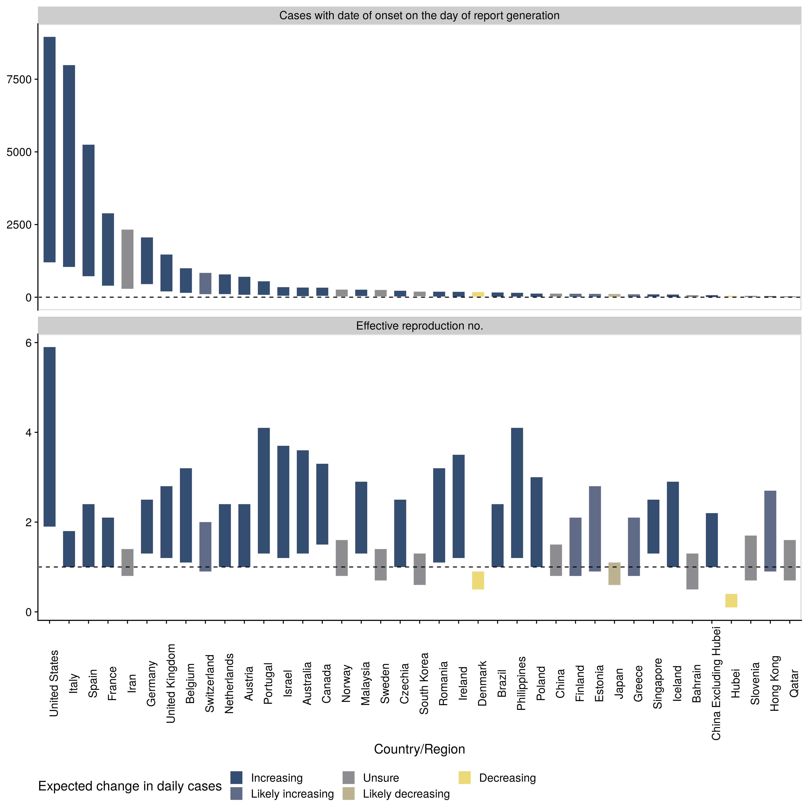
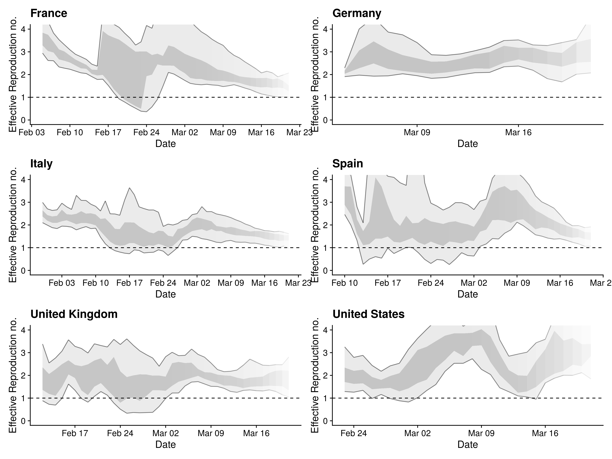
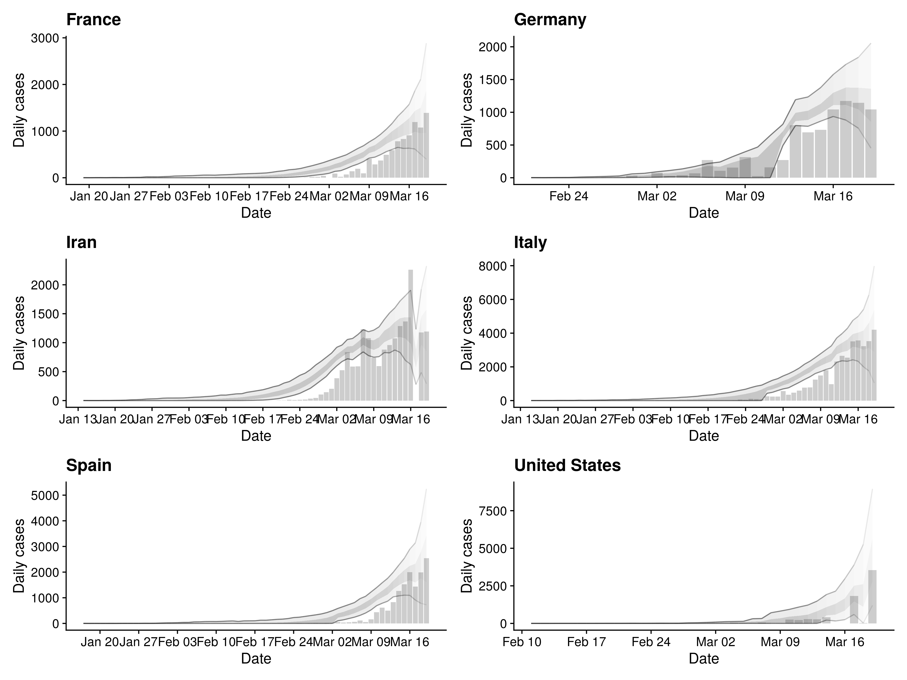

```{r setup, include = FALSE}
knitr::opts_chunk$set(echo = FALSE, eval = TRUE,
                      fig.width = 6, fig.height = 3,
                      message = FALSE,
                      warning = FALSE,
                      dpi = 320)
```


```{r load-packages, include = FALSE}
library(EpiNow)
library(dplyr)
library(rmarkdown)
```

## Expected daily cases by country

```{r}
summary_table <- readRDS("nowcast/summary/summary_table.rds")
```

```{r map, fig.width = 12, fig.height = 6, layout="l-body-outset"}
summary_table %>% 
  dplyr::rename(country = Region) %>% 
  dplyr::filter(!country %in% c("Hubei", "Hong Kong", "China excluding Hubei")) %>% 
  EpiNow::global_map(variable = "Expected change in daily cases") +
  ggplot2::guides(fill = ggplot2::guide_legend(title = "Expected change in daily cases",
                                               ncol = 2))
```

<br>
*Figure 1: Map of the expected change in daily cases*

## Summary of latest reproduction number and case count estimates

```{r, fig.height = 12, fig.width = 12, layout="l-body-outset"}

```

<br>
*Figure 2: Cases with date of onset on the day of report generation and the time-varying estimate of the effective reproduction number (bar = 95% credible interval). Countries/Regions are ordered by the number of expected daily cases and shaded based on the expected change in daily cases. The dotted line indicates the target value of 1 for the effective reproduction no. required for control and a single case required fror elimination.*

## Reproduction numbers over time in the six countries/regions with the most cases currently

```{r summarise-bigr-plot, fig.height = 9, fig.width = 12, layout="l-body-outset"}

```

<br>
*Figure 3: Time-varying estimate of the effective reproduction number (light grey ribbon = 95% credible interval; dark grey ribbon = the interquartile range) in the countries/regions expected to have the highest number of incident cases. Confidence in the estimated values is indicated by shading with reduced shading corresponding to reduced confidence. The dotted line indicates the target value of 1 for the effective reproduction no. required for control.*

## Cases with date of onset on the day of report generation in the six countries/regions with the most cases currently

```{r summarise-cases-plot, fig.height = 9, fig.width = 12, layout="l-body-outset"}

```

<br>
*Figure 4:  Cases by date of report (bars) and estimated cases by date of onset (light grey ribbon = 95% credible interval; dark grey ribbon = the interquartile range) in the countries/regions expected to have the highest number of incident cases. Confidence in the estimated values is indicated by shading with reduced shading corresponding to reduced confidence.*

## Reproduction numbers over time in the all countries/regions modelled

```{r bigr-plot, fig.height = 18, fig.width = 18, layout="l-body-outset"}
knitr::include_graphics("nowcast/summary/rt_plot.png")
```

<br>
*Figure 5: Time-varying estimate of the effective reproduction number (light grey ribbon = 95% credible interval; dark grey ribbon = the interquartile range) in all countries/regions modelled. Confidence in the estimated values is indicated by shading with reduced shading corresponding to reduced confidence. The dotted line indicates the target value of 1 for the effective reproduction no. required for control.*


## Cases with date of onset on the day of report generation in allcountries/regions modelled

```{r cases-plot, fig.height = 18, fig.width = 18, layout="l-body-outset"}
knitr::include_graphics("nowcast/summary/cases_plot.png")
```

*Figure 6:  Cases by date of report (bars) and estimated cases by date of onset (light grey ribbon = 95% credible interval; dark grey ribbon = the interquartile range) in all countries/regions modelled. Confidence in the estimated values is indicated by shading with reduced shading corresponding to reduced confidence.*

## Latest estimates summary table

```{r summary-table-1, layout="l-body-outset"}
summary_table %>% 
 knitr::kable(booktabs = TRUE, longtable = TRUE)
```

<br>
*Table 1: Latest estimates of the number of cases by date of onset, the effective reproduction number, and the doubling time in each country/region included in the analysis. Based on the last 7 days of data. The 95\\% credible interval is shown for each numeric estimate.*
