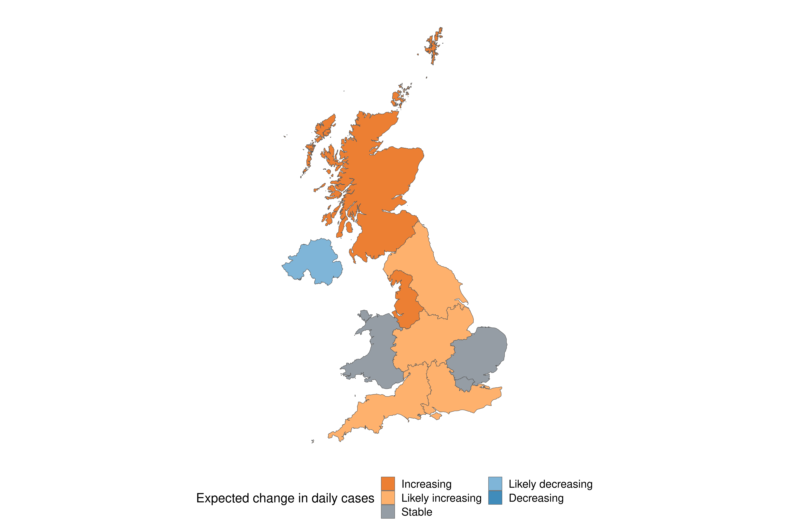

*Using data available up to the:* 2020-08-13

*Note that it takes time for infection to cause symptoms, to get tested for SARS-CoV-2 infection, for a positive test to return and ultimately to enter the case data presented here. In other words, today’s case data are only informative of new infections about two weeks ago. This is reflected in the plots below, which are by date of infection.*

## Expected daily confirmed cases by region

 
*Figure 1: The results of the latest reproduction number estimates (based on estimated confirmed cases with a date of infection on the 2020-08-13) in the United Kingdom, stratified by region, can be summarised by whether confirmed cases are likely increasing or decreasing. This represents the strength of the evidence that the reproduction number in each region is greater than or less than 1, respectively (see the [methods](https://epiforecasts.io/covid/methods.html) for details).*

## National summary

### Summary (estimates as of the 2020-08-13)

*Table 1: Latest estimates (as of the 2020-08-13) of the number of confirmed cases by date of infection, the expected change in daily confirmed cases, the effective reproduction number, the growth rate, and the doubling time (when negative this corresponds to the halving time). The median and 90% credible interval is shown for each numeric estimate.*
 

<table class="table" style="margin-left: auto; margin-right: auto;">
 <thead>
  <tr>
   <th style="text-align:left;">  </th>
   <th style="text-align:left;"> Estimate </th>
  </tr>
 </thead>
<tbody>
  <tr>
   <td style="text-align:left;"> New confirmed cases by infection date </td>
   <td style="text-align:left;"> 1005 (149 -- 2476) </td>
  </tr>
  <tr>
   <td style="text-align:left;"> Expected change in daily cases </td>
   <td style="text-align:left;"> Unsure </td>
  </tr>
  <tr>
   <td style="text-align:left;"> Effective reproduction no. </td>
   <td style="text-align:left;"> 1.1 (0.6 -- 1.7) </td>
  </tr>
  <tr>
   <td style="text-align:left;"> Rate of growth </td>
   <td style="text-align:left;"> 0.02 (-0.12 -- 0.19) </td>
  </tr>
  <tr>
   <td style="text-align:left;"> Doubling/halving time (days) </td>
   <td style="text-align:left;"> 39 (3.6 -- -6) </td>
  </tr>
</tbody>
</table>

### Confirmed cases, their estimated date of report, date of infection, and time-varying reproduction number estimates

 
*Figure 2: A.) Confirmed cases by date of report (bars) and their estimated date of report. B.) Confirmed cases by date of report (bars) and their estimated date of infection. C.) Time-varying estimate of the effective reproduction number. Light ribbon = 90% credible interval; dark ribbon = the 50% credible interval. Estimates from existing data are shown up to the 2020-08-13 from when forecasts are shown. These should be considered indicative only. Estimates based on partial data have been adjusted for right truncation of infections. The vertical dashed line indicates the date of report generation.*

## Regional Breakdown

### Data availability

* Case counts by date, stratified by region, were downloaded from a public curated dataset [@noauthor_coronavirus_2020; @white_coronavirus_2020; @covidregionaldata].
* Case onset dates were estimated using confirmed case counts by date of report and a distribution of reporting delays fitted to an international line-list [@kraemer2020epidemiological; @covidregionaldata].

### Limitations

* Line-list data to inform a United Kingdom specific estimate of the reporting delay was not available. This means that we could also not account for any regional differences.

### Summary of latest reproduction number and confirmed case count estimates by date of infection

 
*Figure 3: Confirmed cases with date of infection on the 2020-08-13 and the time-varying estimate of the effective reproduction number (light bar = 90% credible interval; dark bar = the 50% credible interval.). Regions are ordered by the number of expected daily confirmed cases and shaded based on the expected change in daily confirmedcases. The horizontal dotted line indicates the target value of 1 for the effective reproduction no. required for control and a single case required for elimination.*

### Reproduction numbers over time in the six regions expected to have the most new confirmed cases

 
*Figure 4: Time-varying estimate of the effective reproduction number (light ribbon = 90% credible interval; dark ribbon = the 50% credible interval) in the regions expected to have the highest number of new confirmed cases. Estimates from existing data are shown up to the 2020-08-13 from when forecasts are shown. These should be considered indicative only. Estimates based on partial data have been adjusted for right truncation of infections. The vertical dashed line indicates the date of report generation.*

### Confirmed cases and their estimated date of infection in the six regions expected to have the most new confirmed cases

 
*Figure 5: Confirmed cases by date of report (bars) and their estimated date of infection (light ribbon = 90% credible interval; dark ribbon = the 50% credible interval) in the regions expected to have the highest number of new confirmed cases.  Estimates from existing data are shown up to the 2020-08-13 from when forecasts are shown. These should be considered indicative only.  Estimates based on partial data have been adjusted for right truncation of infections. The vertical dashed line indicates the date of report generation.*

### Confirmed cases and their estimated date of report in the six regions expected to have the most new confirmed cases

 
*Figure 6: Confirmed cases by date of report (bars) and their estimated date of report (light ribbon = 90% credible interval; dark ribbon = the 50% credible interval) in the regions expected to have the highest number of new confirmed cases.  Estimates from existing data are shown up to the 2020-08-13 from when forecasts are shown. These should be considered indicative only.  Estimates based on partial data have been adjusted for right truncation of infections. The vertical dashed line indicates the date of report generation.*

### Reproduction numbers over time in all regions

 
*Figure 7: Time-varying estimate of the effective reproduction number (light ribbon = 90% credible interval; dark ribbon = the 50% credible interval) in all regions. Estimates from existing data are shown up to the 2020-08-13 from when forecasts are shown. These should be considered indicative only. Estimates based on partial data have been adjusted for right truncation of infections. The horizontal dotted line indicates the target value of 1 for the effective reproduction no. required for control. The vertical dashed line indicates the date of report generation.*

### Confirmed cases and their estimated date of infection in all regions

*Figure 8: Confirmed cases by date of report (bars) and their estimated date of infection (light ribbon = 90% credible interval; dark ribbon = the 50% credible interval) in all regions. Estimates from existing data are shown up to the 2020-08-13 from when forecasts are shown. These should be considered indicative only. Estimates based on partial data have been adjusted for right truncation of infections. The vertical dashed line indicates the date of report generation.*

### Confirmed cases and their estimated date of report in all regions

*Figure 9: Confirmed cases by date of report (bars) and their estimated date of report (light ribbon = 90% credible interval; dark ribbon = the 50% credible interval) in all regions. Estimates from existing data are shown up to the 2020-08-13 from when forecasts are shown. These should be considered indicative only. Estimates based on partial data have been adjusted for right truncation of infections. The vertical dashed line indicates the date of report generation.*

### Latest estimates (as of the 2020-08-13)

*Table 2: Latest estimates (as of the 2020-08-13) of the number of confirmed cases by date of infection, the effective reproduction number, the rate of growth, and the doubling time (when negative this corresponds to the halving time) in each region. The median and 90% credible interval is shown.*
 

<!--html_preserve-->

<!--/html_preserve-->

